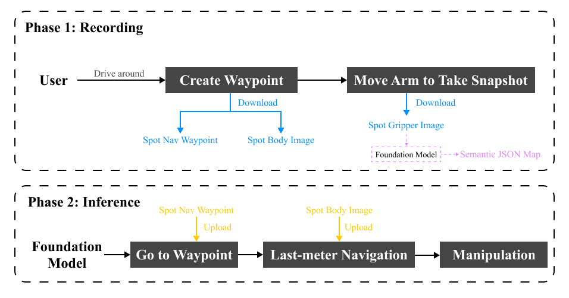

# SentMap Implementation on Boston Dynamics Spot

This repository documents implementation of a semantic topological mapping and execution pipeline on Boston Dynamics Spot. The robot collects waypoints and images during an operator-guided mapping phase, which are used offline to build a semantic map. During inference, Spot navigates to target waypoints, performs last-meter positioning, and executes pick-and-place manipulation.

> This repository is maintained for archival and portfolio purposes.